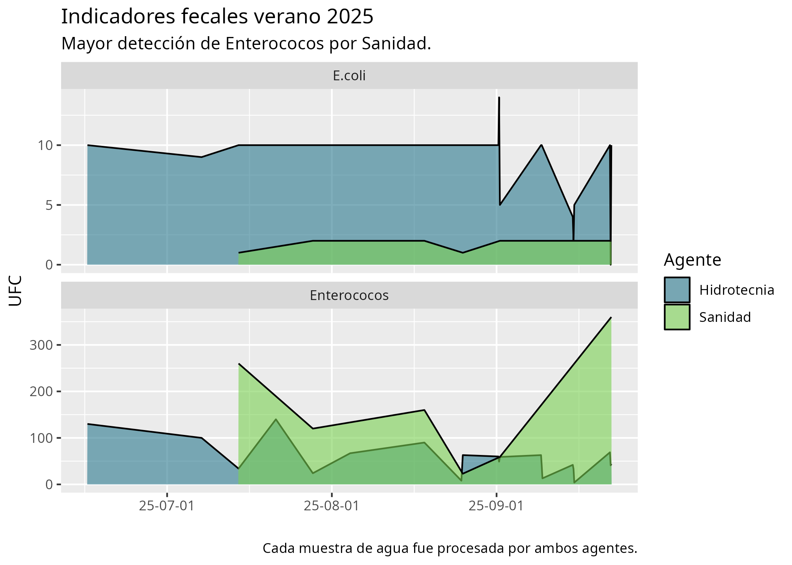
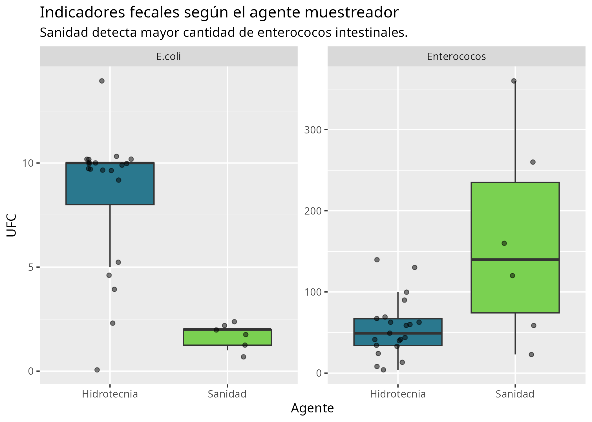
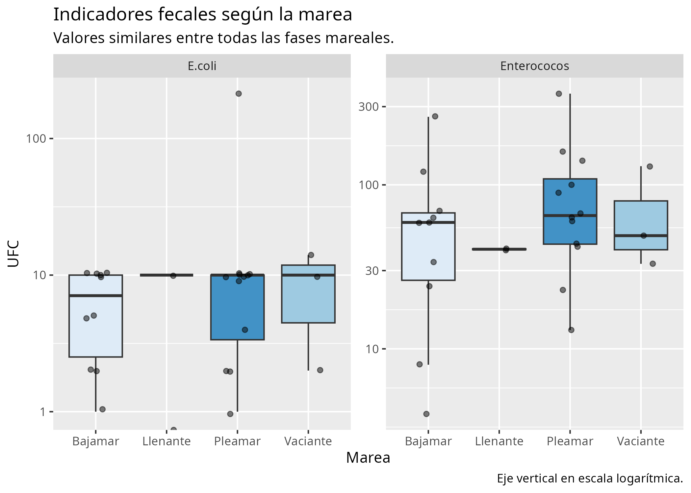

```{r}
#| include: false
source("tidy.R")
source("visualize.R")
source("test.R")
```


## Indicadores convencionales: *E. coli* y entetococos intestinales

### Vista general

Los episodios esporádicos de contaminación por enterococos intestinales se repitieron durante los meses de verano y principios de septiembre 2025.



### Agente muestreador

Sanidad contabilizó una mayor concentración de enterococos intestinales en las mismas muestras procesadas también por Hidrotecnia.



### Ciclo de mareas

Las muestras fueron tomadas durante diferentes fases del ciclo de mareas como un posible factor de control.


Aplicando el análisis de la varianza, los *p* valores calculados superan el nivel de significación 0,05 tanto para *E. coli* como para enterococos intestinales. Los datos recogidos no aportan evidencia suficiente para establecer la marea como variable de control.

```{r}
#| echo: true

# Análisis de la varianza de E. coli para cada estado de la marea.
load("data/aov-ecoli-marea.RData")
summary(aov_ecoli_marea)
```
```{r}
#| echo: true

# Análisis de la varianza de enterococos intestinales para cada estado de la marea.
load("data/aov-ei-marea.RData")
summary(aov_ei_marea)
```
